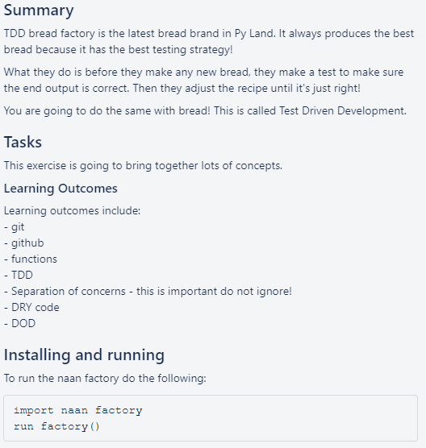
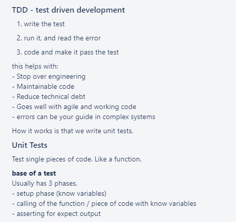
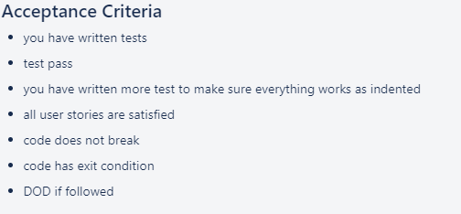

# Task







**User stories**
```
#1
As a user, I can use the make dough with 'water' and 'flour' to make 'dough'.

#2
As a user, I can use the bake dough with dough to get naan.

#3
As a user, I can user the run factory with water and flour and get naan.
```

**My interpretation**
- From my understanding, I will create a Naan Factory class
- This will have the option of manually doing the two methods:
    1. Making dough
    2. Baking dough
- But the factory should also have the option to simply run by itself with a method. All one would need to do is simply input water, flour and set the baking time.
- This is what I implemented

**Explanation**
- Firstly, we must create a test class in a file called ```test_factory.py```

<br>

- We then import ```unittest``` into the file, allowing us to use the ```unittest.TestCase```

<br>

- We write the test cases out as follows:
```python
import unittest
from factory import NaanFactory

class Test(unittest.TestCase):
    factory = NaanFactory()
    
    # We want to be able to input water and flour to output dough
    # Any other combination should not yield dough
    def test_make_dough(self):
        self.assertEqual(self.factory.make_dough("water", "flour"), "dough")
        self.assertNotEqual(self.factory.make_dough("water", "rice"), "dough")
    
    # We want to be able to bake our dough to create naan
    # The optimal time is 5 minutes, but allow 4 - 6 minutes
    # Depending on what we put to bake and for how long, we get different results
    def test_bake_dough(self):
        self.assertEqual(self.factory.bake_dough("dough", 5), "naan")
        self.assertNotEqual(self.factory.bake_dough("not dough", 5), "naan")
        self.assertEqual(self.factory.bake_dough("dough", 7), "burnt naan")
        self.assertEqual(self.factory.bake_dough("dough", 3.9), "undercooked naan")

    # We should just be able to input water and flour as well as set the timing
    # for the baking and eventually output naan
    def test_run_factory(self):
        self.assertEqual(self.factory.run_factory("water", "flour", 5), "naan") 
```

<br>

- Testing ```make_dough```:
    - This should only return ```dough``` if the two ingredients are ```flour``` and ```water```, otherwise it's ```not dough```

<br>

- Testing ```bake_dough```:
    - If what we're baking isn't ```dough``` then the test should fail, regardless of how long we bake it
    - Depending on how long we bake ```dough``` we should get three options (```naan```, ```undercooked naan``` and ```burnt naan```)

<br>

- Testing ```run_factory```:
    - This is just the combination of the previous two functions
    - The test for this is derived from the tests of the previous two


- Run the test using ```pytest```
```

================================================================================================= short test summary info ================================================================================================== 
ERROR test_factory.py - NameError: name 'NaanFactory' is not defined
!!!!!!!!!!!!!!!!!!!!!!!!!!!!!!!!!!!!!!!!!!!!!!!!!!!!!!!!!!!!!!!!!!!!!!!!!!!!!!!!!!!!!!!!!! Interrupted: 1 error during collection !!!!!!!!!!!!!!!!!!!!!!!!!!!!!!!!!!!!!!!!!!!!!!!!!!!!!!!!!!!!!!!!!!!!!!!!!!!!!!!!!!!!!!!!!! 
===================================================================================================== 1 error in 0.46s =====================================================================================================
```

<br>

- There are failures and we must then write a program to fix these errors

<br>

- Create a ```factory.py``` file

<br>

- Create a ```NaanFactory``` class inside it:
```python
    Class NaanFactory:
        pass
```

<br>

- Running ```pytest``` again yields:
```
================================================================================================= short test summary info ==================================================================================================
FAILED test_factory.py::Test::test_bake_dough - AttributeError: 'NaanFactory' object has no attribute 'bake_dough'
FAILED test_factory.py::Test::test_make_dough - AttributeError: 'NaanFactory' object has no attribute 'make_dough'
FAILED test_factory.py::Test::test_run_factory - AttributeError: 'NaanFactory' object has no attribute 'run_factory'
```
<br>

- We must now add the required methods inside the class:
```python
    class NaanFactory:

    # Given two inputs, this will either make dough or not dough
    # The order of input shouldn't matter so I put them into a list
    # and test only for inclusion
    def make_dough(self, input1, input2):
        ingredients = [input1, input2]
        if "water" in ingredients and "flour" in ingredients:
            return "dough"
        else:
            return "not dough"


    # This will bake dough and return values accordingly
    # If baked too long it's burnt, too short it's undercooked
    def bake_dough(self, input, time):
        if input != "dough":
            return "This oven only bakes dough!"

        if time < 4:
            return "undercooked naan"
        
        if 4 <= time <= 6:
            return "naan"

        if time > 6:
            return "burnt naan"


    # This will concatenate both functions into one
    def run_factory(self, input1, input2, time):
        bake_what = self.make_dough(input1, input2)
        r = self.bake_dough(bake_what, time)
        return r
```

- We can now run the test again. We use ```pytest -v``` to get more information:
```
PS C:\Users\Jared\Documents\GitHub\active\bread_factory_task> pytest -v
=================================================================================================== test session starts ==================================================================================================== 
platform win32 -- Python 3.9.0, pytest-6.1.2, py-1.9.0, pluggy-0.13.1 -- c:\users\jared\appdata\local\programs\python\python39\python.exe
cachedir: .pytest_cache
rootdir: C:\Users\Jared\Documents\GitHub\active\bread_factory_task
collected 3 items                                                                                                                                                                                                            

test_factory.py::Test::test_bake_dough PASSED                                                                                                                                                                         [ 33%] 
test_factory.py::Test::test_make_dough PASSED                                                                                                                                                                         [ 66%] 
test_factory.py::Test::test_run_factory PASSED                                                                                                                                                                        [100%] 

==================================================================================================== 3 passed in 0.30s ===================================================================================================== 
```

<br>

**Afterthoughts**

- We have created a python script that passes all the required tests. 
- Since the tests were made with the user stories in mind, we have produced a program that is not overengineered but fulfills all the user stories' demands.
